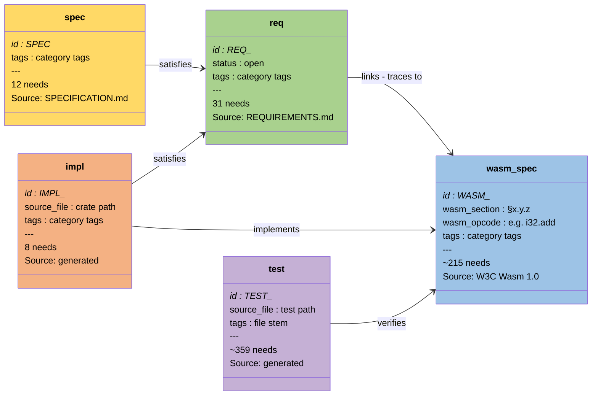

```mermaid
classDiagram
    direction LR

    class wasm_spec {
        id : WASM_*
        wasm_section : §x.y.z
        wasm_opcode : e.g. i32.add
        tags : category tags
        ---
        ~215 needs
        Source: W3C Wasm 1.0
    }

    class req {
        id : REQ_*
        status : open
        tags : category tags
        ---
        31 needs
        Source: REQUIREMENTS.md
    }

    class spec {
        id : SPEC_*
        tags : category tags
        ---
        12 needs
        Source: SPECIFICATION.md
    }

    class impl {
        id : IMPL_*
        source_file : crate path
        tags : category tags
        ---
        8 needs
        Source: generated
    }

    class test {
        id : TEST_*
        source_file : test path
        tags : file stem
        ---
        ~359 needs
        Source: generated
    }

    req --> wasm_spec : links - traces to
    spec --> req : satisfies
    impl --> req : satisfies
    impl --> wasm_spec : implements
    test --> wasm_spec : verifies

    style wasm_spec fill:#9DC3E6,color:#000
    style req fill:#A9D18E,color:#000
    style spec fill:#FFD966,color:#000
    style impl fill:#F4B183,color:#000
    style test fill:#C5B0D5,color:#000
```
